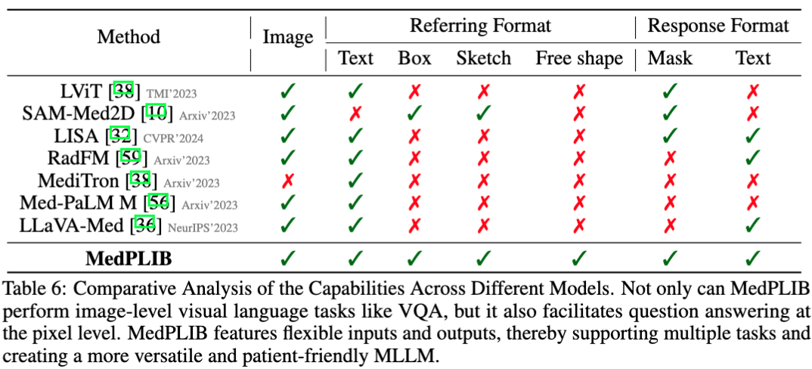
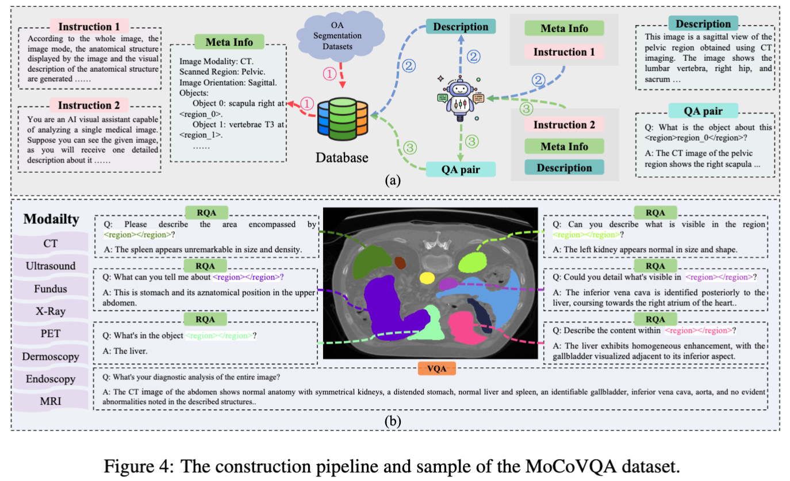

<!-- The official repository of MedPLIB: Towards a Multimodal Large Language Model with Pixel-Level Insight for Biomedicine. -->
<p align="center">
    
<p>
<h2 align="center"> <a href="">Towards a Multimodal Large Language Model with Pixel-Level Insight for Biomedicine</a></h2>
<a src="https://img.shields.io/badge/cs.CV-2312.09278-b31b1b?logo=arxiv&logoColor=red" href="https://arxiv.org/pdf/2412.09278"> 
</a> 

<h5 align="center"> If you like our project, please give us a star ⭐ on GitHub for latest update. 


<p align="center">
    
<p>


# 😮 Hightlights
MedPLIB shows excellent performance in pixel-level understanding in biomedical field.

- ✨ MedPLIB is a biomedical MLLM with a huge breadth of abilities and supports multiple imaging modalities. Not only can it perform image-level visual language tasks like VQA, but it also facilitates question answering at the pixel level.

<p align="center">
    
<p>


- ✨ We constructe MeCoVQA Dataset. It comprises an array of 8 modalities with a total of 310k pairs for complex medical imaging question answering and image region understanding.
<p align="center">
    
<p>


# 🔥 Updates
- 2025-01-09: 🔥🔥🔥 We release the model weight and MeCoVQA dataset.
- 2024-12-19: We release the code.
- 2024-12-10: We release the paper.
- 2024-12-09: 🔥🔥🔥 This paper was accepted by AAAI2025. 
- 2024-06-14: We release the code link.


# Contents
- [Demo](#🍉Demo)
- [Installation](#🛠️Installation)
- [Dataset](#🗃️Dataset)
- [Train](#📀Train)
- [Test](#Test)
- [Model Zoo](#Model_Zoo)
- [Acknowledgement](#👍Acknowledgement)
- [License](#🔒License)
- [Model Use](#🪜Model-Use)
- [Citation](#✏️Citation)

# 🍉Demo

### Gradio Web UI
We recommend trying our web demo, which includes all the features currently supported by MedPLIB. To run our demo, you need to download or train MedPLIB to make the checkpoints locally. Please run the following commands one by one.

```bash
# launch the server controller
python -m model.serve.controller --host 0.0.0.0 --port 64000
```

```bash
# launch the web server
python -m model.serve.gradio_web_server --controller http://localhost:64000 --model-list-mode reload --add_region_feature --port 64001 
```

```bash
# launch the model worker
CUDA_VISIBLE_DEVICES=0 python -m model.serve.model_worker --host localhost --controller http://localhost:64000 --port 64002 --worker http://localhost:64002 --model-path /path/to/the/medplib_checkpoints --add_region_feature --device_map cuda --vision_pretrained /path/to/the/sam-med2d_b.pth
```

- Pixel grounding: 
<p align="center">
    
<p>


- Region VQA:
<p align="center">
    
<p>

- VQA:
<p align="center">
    
<p>


# 🛠️Installation

1. Clone this repository and navigate to MedPLIB folder
```bash
git clone https://github.com/ShawnHuang497/MedPLIB.git
cd MedPLIB
```

2. Install Package
```Shell
conda create -n medplib python=3.10 -y
conda activate medplib
pip install --upgrade pip 
pip install -r requirements.txt
```

3. Install additional packages for training cases
```Shell
pip install ninja==1.11.1.1
pip install flash-attn==2.5.2 --no-build-isolation
```

# 🗃️Dataset
1. Please download MeCoVQA dataset from [Google Drive](https://drive.google.com/file/d/1zIZJ5OBmV3OPc41H_Iaz9mdEh7wHmHqv/view?usp=drive_link).
2. Download the images from SA-Med2D-20M at [Huggingface](https://huggingface.co/datasets/OpenGVLab/SA-Med2D-20M).

# 📀Train
## Stage I
We perfrom the pre-training stage I to get the projector checkpoints. Please obtain the llava_med_alignment_500k dataset according to [LLaVA-Med](https://github.com/microsoft/LLaVA-Med), and then follow the usage tutorial of [LLaVA-v1.5](https://github.com/haotian-liu/LLaVA/tree/v1.1.0) to pretrain.


## Stage II
```Shell
sh scripts/train_stage2.sh
```
## Stage III
```Shell
sh scripts/train_stage3.sh
```
## Stage IV
```Shell
sh scripts/train_stage4.sh
```


# 🥭 Model_Zoo
Please download MedPLIB model weight from [Huggingface](https://huggingface.co/Huangxs/MedPLIB-7b-2e).

# 🥭 Test

### Pixel Grounding
```Shell
TRANSFORMERS_OFFLINE=1 deepspeed --include=localhost:1 --master_port=64995 model/eval/vqa_infer.py \
    --version="/path/to/the/medplib_checkpoints" \
    --vision_tower='/path/to/the/clip-vit-large-patch14-336' \
    --answer_type='open' \
    --val_data_path='/path/to/the/pixel_grounding_json_file' \
    --image_folder='/path/to/the/SAMed2D_v1' \
    --vision_pretrained="/path/to/the/sam-med2d_b.pth" \
    --eval_seg \
    --moe_enable \
    --region_fea_adapter \
    # --vis_mask \
```


### Region_VQA & VQA
Infer to generate the prediction jsonl file.
```Shell
sh model/eval/infer_parallel_medplib.sh
```

Calcuate the metrics.

```Shell
python model/eval/cal_metric.py \
    --pred="/path/to/the/jsonl_file" \
```


# 👍Acknowledgement

We thank the following works for giving us the inspiration and part of the code: [LISA](https://github.com/dvlab-research/LISA), [MoE-LLaVA](https://github.com/PKU-YuanGroup/MoE-LLaVA), [LLaVA](https://github.com/haotian-liu/LLaVA), [SAM-Med2D](https://github.com/OpenGVLab/SAM-Med2D), [SAM](https://github.com/facebookresearch/segment-anything) and [SEEM](https://github.com/UX-Decoder/Segment-Everything-Everywhere-All-At-Once).

# 🪜Model Use
### Intended Use
The data, code, and model checkpoints are intended to be used solely for (I) future research on visual-language processing and (II) reproducibility of the experimental results reported in the reference paper. The data, code, and model checkpoints are not intended to be used in clinical care or for any clinical decision making purposes.
### Primary Intended Use
The primary intended use is to support AI researchers reproducing and building on top of this work. MedPLIB and its associated models should be helpful for exploring various biomedical pixel grunding and vision question answering (VQA) research questions.
### Out-of-Scope Use
Any deployed use case of the model --- commercial or otherwise --- is out of scope. Although we evaluated the models using a broad set of publicly-available research benchmarks, the models and evaluations are intended for research use only and not intended for deployed use cases. 


# 🔒License
* The majority of this project is released under the Apache 2.0 license as found in the [LICENSE](https://github.com/ShawnHuang497/MedPLIB/blob/main/LICENSE) file.
* The service is a research preview intended for non-commercial use only, subject to the model [License](https://github.com/facebookresearch/llama/blob/main/MODEL_CARD.md) of LLaMA, [Terms of Use](https://openai.com/policies/terms-of-use) of the data generated by OpenAI, and [Terms of Use](https://openxlab.org.cn/datasets/GMAI/SA-Med2D-20M) of SAM-Med2D-20M. Please contact us if you find any potential violation.


# ✏️Citation
If you find our paper and code useful in your research, please consider giving a star and citation.

```BibTeX
@article{huang2024towards,
  title={Towards a Multimodal Large Language Model with Pixel-Level Insight for Biomedicine},
  author={Huang, Xiaoshuang and Shen, Lingdong and Liu, Jia and Shang, Fangxin and Li, Hongxiang and Huang, Haifeng and Yang, Yehui},
  journal={arXiv preprint arXiv:2412.09278},
  year={2024}
}
```
